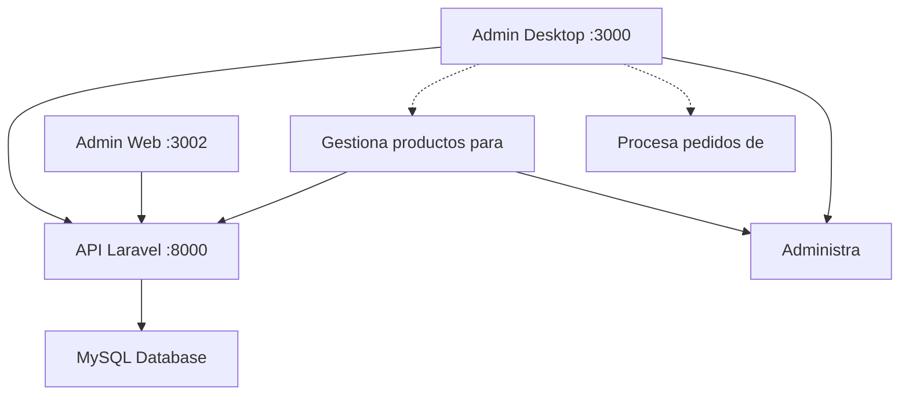

# 🔗 Configuración del Sistema Integrado - Crepes & Coffee

## 📋 Arquitectura del Sistema

### 🏗️ **Componentes del Sistema:**

1. **🖥️ Admin Desktop** (Puerto 3000)
   - Aplicación Electron para administradores
   - Interfaz exclusiva para gestión
   - Conexión directa con API Laravel

2. **🌐 Cliente Web** (Puerto 3001)
   - Aplicación React para clientes
   - E-commerce público
   - Carrito de compras y pagos

3. **🔧 Admin Web** (Puerto 3002)
   - Panel web de administración (backup)
   - Interfaz alternativa de gestión

4. **⚙️ API Laravel** (Puerto 8000)
   - Backend central del sistema
   - API RESTful con autenticación
   - Base de datos MySQL

5. **🗄️ Base de Datos MySQL**
   - Almacenamiento centralizado
   - Datos compartidos entre módulos

## 🔌 Conexiones del Sistema



## 🚀 Comandos de Inicio

### **1. 🗄️ Preparar Base de Datos:**
```bash
cd admin-laravel
php artisan migrate:fresh --seed
```

### **2. ⚙️ Iniciar API Backend:**
```bash
cd admin-laravel
php artisan serve --host=127.0.0.1 --port=8000
```

### **3. 🖥️ Iniciar Admin Desktop:**
```bash
cd admin-desktop
npm run electron-dev
```

### **4. 🌐 Iniciar Cliente Web:**
```bash
cd cliente-web
PORT=3001 npm start
```

### **5. 🔧 Iniciar Admin Web (Opcional):**
```bash
cd admin-web
PORT=3002 npm start
```

## 🔑 Credenciales del Sistema

### **👨‍💼 Administrador (Desktop):**
- **Email**: `admin@crepesandcoffee.com`
- **Contraseña**: `admin123`
- **Acceso**: Solo desde aplicación de escritorio

### **👤 Usuario Cliente (Web):**
- **Registro**: Libre en cliente web
- **Login**: Email y contraseña personalizados

## 🌐 URLs del Sistema

| Módulo | URL | Puerto | Descripción |
|--------|-----|--------|-------------|
| **API Laravel** | `http://localhost:8000` | 8000 | Backend central |
| **Admin Desktop** | Aplicación Electron | 3000 | Panel administrativo |
| **Cliente Web** | `http://localhost:3001` | 3001 | E-commerce público |
| **Admin Web** | `http://localhost:3002` | 3002 | Panel web alternativo |

## 📊 Endpoints de la API

### **🔐 Autenticación:**
- `POST /api/login` - Login general
- `POST /api/register` - Registro de clientes
- `POST /api/admin/login` - Login exclusivo admin desktop

### **🛍️ Productos:**
- `GET /api/productos` - Listar productos (público)
- `GET /api/admin/products` - Gestión productos (admin)
- `POST /api/admin/products` - Crear producto (admin)
- `PUT /api/admin/products/{id}` - Actualizar producto (admin)
- `DELETE /api/admin/products/{id}` - Eliminar producto (admin)

### **📦 Pedidos:**
- `GET /api/pedidos` - Mis pedidos (cliente)
- `POST /api/pedidos` - Crear pedido (cliente)
- `GET /api/admin/orders` - Todos los pedidos (admin)
- `PUT /api/admin/orders/{id}/status` - Cambiar estado (admin)

### **👥 Usuarios:**
- `GET /api/admin/users` - Listar usuarios (admin)
- `PUT /api/admin/users/{id}` - Actualizar usuario (admin)
- `DELETE /api/admin/users/{id}` - Eliminar usuario (admin)

### **🛒 Carrito:**
- `GET /api/carrito` - Ver carrito (cliente)
- `POST /api/carrito/agregar` - Agregar al carrito (cliente)
- `PUT /api/carrito/actualizar` - Actualizar carrito (cliente)
- `DELETE /api/carrito/eliminar/{id}` - Eliminar del carrito (cliente)

## 🔒 Seguridad del Sistema

### **🛡️ Autenticación:**
- Laravel Sanctum para tokens API
- Middleware de verificación de roles
- Verificación User-Agent para admin desktop

### **🔐 Permisos:**
- **Admin Desktop**: Acceso completo al sistema
- **Cliente Web**: Solo funciones de compra
- **Admin Web**: Panel alternativo (mismo nivel que desktop)

### **🚫 Restricciones:**
- Login admin solo desde Electron
- CORS configurado para puertos específicos
- Tokens con scopes limitados

## 🗄️ Estructura de Base de Datos

### **Tablas Principales:**
- `users` - Usuarios del sistema (clientes y admins)
- `productos` - Catálogo de productos
- `categorias` - Categorías de productos
- `pedidos` - Pedidos realizados
- `detalle_pedidos` - Items de cada pedido
- `personal_access_tokens` - Tokens de autenticación

## 🔄 Flujo de Datos

### **🛒 Proceso de Compra:**
1. Cliente navega productos en web
2. Agrega productos al carrito
3. Realiza pedido con Mercado Pago
4. Pedido se registra en base de datos
5. Admin recibe notificación en desktop
6. Admin procesa y actualiza estado

### **📋 Gestión Administrativa:**
1. Admin accede desde desktop
2. Ve dashboard con estadísticas
3. Gestiona productos, pedidos, usuarios
4. Cambios se reflejan en cliente web
5. Datos sincronizados en tiempo real

## 🚨 Solución de Problemas

### **❌ Error de Conexión API:**
```bash
# Verificar que Laravel esté ejecutándose
curl http://localhost:8000/api/productos

# Reiniciar servidor Laravel
cd admin-laravel
php artisan serve --host=127.0.0.1 --port=8000
```

### **🖥️ Error en Admin Desktop:**
```bash
# Limpiar y reinstalar dependencias
cd admin-desktop
rm -rf node_modules package-lock.json
npm install
npm run electron-dev
```

### **🌐 Error en Cliente Web:**
```bash
# Verificar puerto disponible
cd cliente-web
PORT=3001 npm start
```

### **🗄️ Error de Base de Datos:**
```bash
# Recrear base de datos
cd admin-laravel
php artisan migrate:fresh --seed
```

## 📱 Características Específicas

### **🖥️ Admin Desktop:**
- ✅ Interfaz nativa de escritorio
- ✅ Menús del sistema operativo
- ✅ Atajos de teclado (Ctrl+N, F11, etc.)
- ✅ Drag & Drop para imágenes
- ✅ Diálogos nativos de archivos
- ✅ Notificaciones del sistema

### **🌐 Cliente Web:**
- ✅ Responsive design
- ✅ Carrito de compras persistente
- ✅ Integración Mercado Pago
- ✅ Registro y login de usuarios
- ✅ Historial de pedidos
- ✅ Catálogo con filtros

### **⚙️ API Laravel:**
- ✅ Autenticación con Sanctum
- ✅ Middleware de roles
- ✅ Validación de datos
- ✅ Seeders con datos iniciales
- ✅ CORS configurado
- ✅ Rate limiting

## 🎯 Estado Actual

### **✅ Completado:**
- [x] Estructura base del sistema
- [x] API Laravel con endpoints
- [x] Base de datos con migraciones
- [x] Admin Desktop con Electron
- [x] Cliente Web funcional
- [x] Autenticación y roles
- [x] CRUD completo de productos
- [x] Sistema de pedidos
- [x] Carrito de compras

### **🔄 En Desarrollo:**
- [ ] Integración completa Mercado Pago
- [ ] Notificaciones en tiempo real
- [ ] Optimización de imágenes
- [ ] Sistema de backup
- [ ] Deployment automatizado

## 🚀 Próximos Pasos

1. **🔧 Completar funcionalidades faltantes**
2. **🧪 Testing integral del sistema**
3. **📦 Empaquetado de aplicación desktop**
4. **🌐 Deployment en producción**
5. **📊 Monitoreo y analytics**

---

**💡 Nota**: Este sistema está diseñado para funcionar de manera integrada. Todos los módulos deben estar ejecutándose simultáneamente para el funcionamiento completo. 